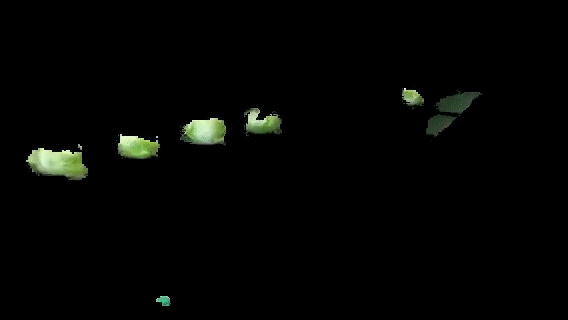

# CabbageExtraction
This is a school project: a C++ program that can extract objects of a certain color from videos, using OpenCV.

This code, by default, extracts the cabbages from the video: data/choux.mp4. You can also run it with the name of another video as parameter, but the extraction is based on the green color of the cabbages.

To extract the cabbages, we play the video frame by frame and apply an extraction based on the color. First we convert the frame to the HSV system (Hue, Saturation, Value) and we extract the colors contained in a certain interval corresponding to the green of the cabbage.

While the video is playing, the user can do several things:
- Pressing the space bar will apply the extraction or display the original frames
- The r key restarts the video from the beginning
- The p key pauses the video, it will resume only if the user presses p again
- If the user presses q, the video ends

Once the video is finished (either when it reaches the end or because the user has pressed q), the extraction is applied to the whole video and the video is saved in the current folder. The saving process takes a few seconds.

## Instructions

Navigate to the Exercice1/ folder.

To build the program, use the commands: "cmake ." and then "make" .

To run the program, execute ChouxExtraction . 

(OpenCV must be installed.)
